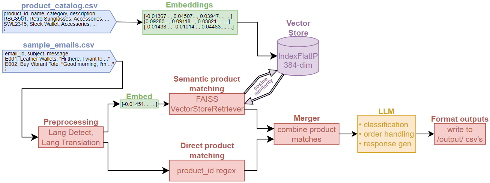
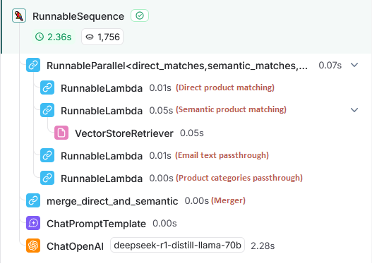
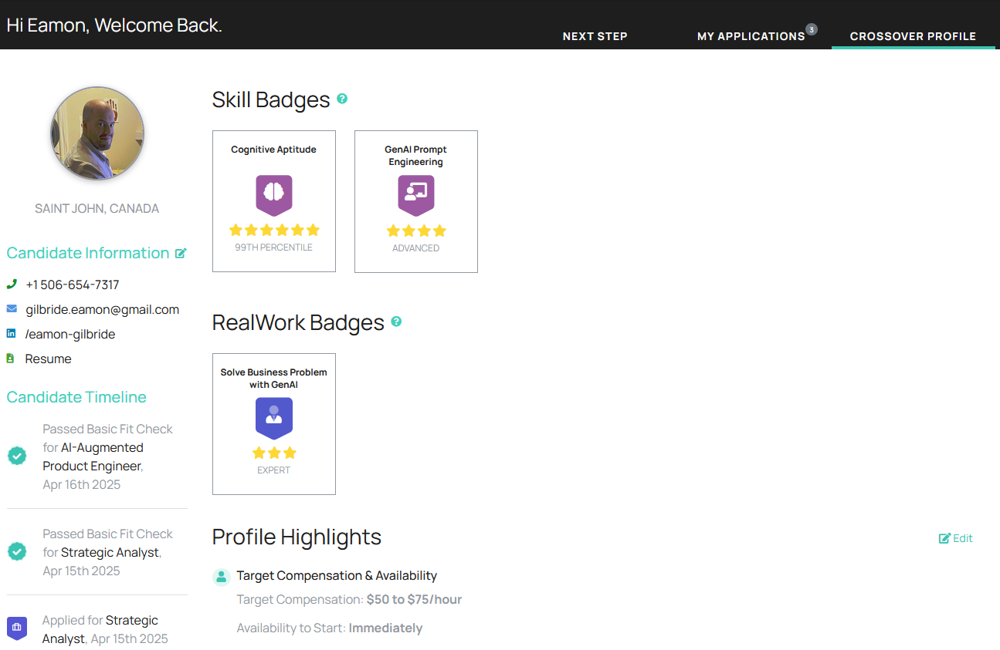

# LLM Email Agent with RAG, FAISS, LangChain, LangSmith
## Objective
The challenge is to build an AI-driven email assistant for an online fashion retailer. This assistant will automatically:
- Classify incoming customer emails as **order requests** or **product inquiries**
- Check orders against real-time stock levels
- Generate concise, on-brand responses for both successful and out-of-stock orders
- Answer general product questions using only relevant catalog snippets, so the system scales to 100,000+ products without blowing past token limits

## Inputs
From the RAG-FAISS-email-agent/data folder, you are given:
- **Products**: A CSV of product records (ID, name, category, description, stock, seasons, price)
- **Emails**: A CSV of customer emails (email ID, subject, body)

## Outputs
### **Task A**: Classify emails.
- Classify each email as either a **"product inquiry"** or an **"order request"**. Ensure that the classification accurately reflects the intent of the email.
  - **Output**: Create a "email-classifcations.csv" file under RAG-FAISS-email-agent/output/ with columns: email ID, category.

### **Task B**: Process order requests.
1. Process Orders
    - For each order request, verify product availability in stock.
    - If the order can be fulfilled, create a new order line with the status “created”.
    - If the order cannot be fulfilled due to insufficient stock, create a line with the status “out of stock” and include the requested quantity.
    - Update stock levels after processing each order.
    - Record each product request from the email.
    - **Output**: Create a "order-status.csv" file under /output/ with columns: email ID, product ID, quantity, status (**"created"** or **"out of stock"**).
2. Generate responses
    - Create response emails based on the order processing results:
      - If the order is fully processed, inform the customer and provide product details.
      - If the order cannot be fulfilled or is only partially fulfilled, explain the situation, specify the out-of-stock items, and suggest alternatives or options (e.g., waiting for restock).
    - **Output**: Create a "order-response.csv" file under /output/ with columns: email ID, response.

### **Task C**: Handle product inquiry.

Customers may ask general open questions.
  - Respond to product inquiries using relevant information from the product catalog.
  - Ensure your solution scales to handle a full catalog of over 100,000 products without excessive token usage. Avoid including the entire catalog in the prompt.
  - **Output**: Create a "inquiry-response.csv" file under /output/ with columns: email ID, response.


## Solution
This repository implements a fully automated email agent by integrating FAISS-powered RAG with a LangChain-built LLM workflow, all traced in LangSmith. It focuses on high accuracy and scalability with respect to product catalog size, and so LLM tokens are fairly generously traded-off for accuracy (one LLM prompt per email). For a more scalable solution in terms of tokens-to-emails, clustering algorithms showed promising results during testing.

In this solution we handle challenges such as input validation, language detection and translation, and strict JSON-only prompt engineering. This solution was tested with gpt-4o, qwen-qwq-32b, and deepseek-r1-distill-llama-70b.
### Solution Block Diagram
<p align="center">
  
</p>

### Sample LangSmith Trace

<p align="center">
  
</p>

To see the full details of the above sample, view this trace at:

https://smith.langchain.com/public/028a828d-0551-418d-b2b0-7fcbc64c1945/r

## Quick Start Guide

1. **Clone the repo**
   ```bash
   git clone https://github.com/eamongilbride/AI-projects.git
   cd AI-projects
2. **Install dependencies**
   ```bash
   pip install -r requirements.txt
3. **Configure environment**
   ```bash
   cp .env.example .env
   # Edit .env to add:
   # OPENAI_API_KEY, LANGSMITH_API_KEY, LLM, etc.
4. **Run the program**
   ```bash
   cd RAG-FAISS-email-agent
   # To run on all 23 of the sample emails:
   python main.py

   # To run on only the first N sample emails:
   python main.py --demo N
## Appendix
### Certifications & Evaluations
As referred to in my resume, I earned the following generative-AI evaluation badges on Crossover.com:
<p align="center">
  
</p>